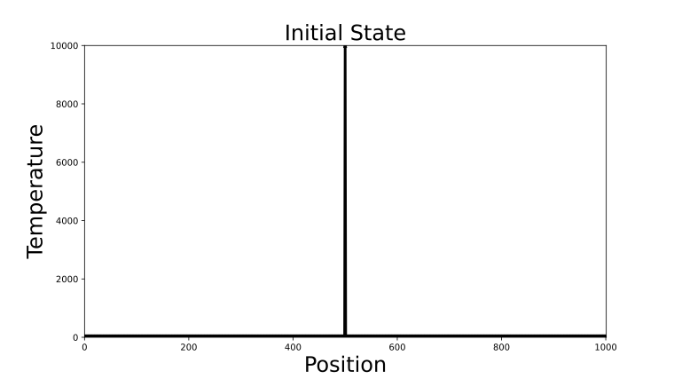
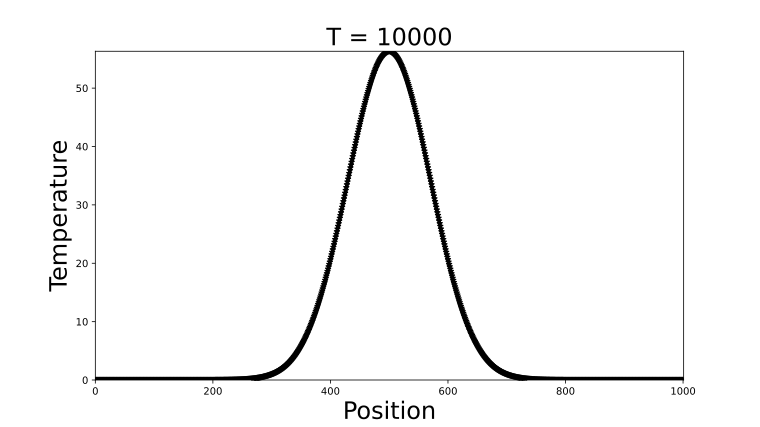

========
Examples
========

.. _cuda-vecadd:

Vector Addition
===============
This example uses Numba to create on-device arrays and a vector addition kernel;
it is a warmup for learning how to write GPU kernels using Numba. We'll begin
with some required imports:

.. literalinclude:: ../../../numba/cuda/tests/doc_examples/test_vecadd.py
   :language: python
   :caption: from ``test_ex_vecadd`` in ``numba/cuda/tests/doc_examples/test_vecadd.py``
   :start-after: ex_vecadd.import.begin
   :end-before: ex_vecadd.import.end
   :dedent: 8
   :linenos:

The following function is the kernel. Note that it is defined in terms of Python
variables with unspecified types. When the kernel is launched, Numba will
examine the types of the arguments that are passed at runtime and generate a
CUDA kernel specialized for them.

Note that Numba kernels do not return values and must write any output into
arrays passed in as parameters (this is similar to the requirement that CUDA
C/C++ kernels have ``void`` return type). Here we pass in ``c`` for the results
to be written into.

.. literalinclude:: ../../../numba/cuda/tests/doc_examples/test_vecadd.py
   :language: python
   :caption: from ``test_ex_vecadd`` in ``numba/cuda/tests/doc_examples/test_vecadd.py``
   :start-after: ex_vecadd.kernel.begin
   :end-before: ex_vecadd.kernel.end
   :dedent: 8
   :linenos:

:func:`cuda.to_device() <numba.cuda.to_device>` can be used create device-side
copies of arrays.  :func:`cuda.device_array_like()
<numba.cuda.device_array_like>` creates an uninitialized array of the same shape
and type as an existing array.  Here we transfer two vectors and create an empty
vector to hold our results:

.. literalinclude:: ../../../numba/cuda/tests/doc_examples/test_vecadd.py
   :language: python
   :caption: from ``test_ex_vecadd`` in ``numba/cuda/tests/doc_examples/test_vecadd.py``
   :start-after: ex_vecadd.allocate.begin
   :end-before: ex_vecadd.allocate.end
   :dedent: 8
   :linenos:

A call to :meth:`forall() <numba.cuda.dispatcher.Dispatcher.forall>` generates
an appropriate launch configuration with a 1D grid (see
:ref:`cuda-kernel-invocation`) for a given data size and is often the simplest
way of launching a kernel:

.. literalinclude:: ../../../numba/cuda/tests/doc_examples/test_vecadd.py
   :language: python
   :caption: from ``test_ex_vecadd`` in ``numba/cuda/tests/doc_examples/test_vecadd.py``
   :start-after: ex_vecadd.forall.begin
   :end-before: ex_vecadd.forall.end
   :dedent: 8
   :linenos:

This prints:

.. code-block:: none

   [0.73548323 1.32061059 0.12582968 ... 1.25925809 1.49335059 1.59315414]

One can also configure the grid manually using the subscripting syntax. The
following example launches a grid with sufficient threads to operate on every
vector element:

.. literalinclude:: ../../../numba/cuda/tests/doc_examples/test_vecadd.py
   :language: python
   :caption: from ``test_ex_vecadd`` in ``numba/cuda/tests/doc_examples/test_vecadd.py``
   :start-after: ex_vecadd.launch.begin
   :end-before: ex_vecadd.launch.end
   :dedent: 8
   :linenos:

This also prints:

.. code-block:: none

   [0.73548323 1.32061059 0.12582968 ... 1.25925809 1.49335059 1.59315414]

.. _cuda-laplace:

1D Heat Equation
=====================
This example solves Laplace's equation in one dimension for a certain set of initial
conditions and boundary conditions. A full discussion of Laplace's equation is out of
scope for this documentation, but it will suffice to say that it describes how heat
propagates through an object over time. It works by discretizing the problem in two ways:

1. The domain is partitioned into a mesh of points that each have an individual temperature.
2. Time is partitioned into discrete intervals that are advanced forward sequentially.

Then, the following assumption is applied: The temperature of a point after some interval 
has passed is some weighted average of the temperature of the points that are directly
adjacent to it. Intuitively, if all the points in the domain are very hot
and a single point in the middle is very cold, as time passes, the hot points will cause
the cold one to heat up and the cold point will cause the surrounding hot pieces to cool
slightly. Simply put, the heat spreads throughout the object.

We can implement this simulation using a Numba kernel. Let's start simple by assuming
we have a one dimensional object which we'll represent with an array of values. The position 
of the element in the array is the position of a point within the object, and the value
of the element represents the temperature. 

.. literalinclude:: ../../../numba/cuda/tests/doc_examples/test_laplace.py
   :language: python
   :caption: from ``test_ex_laplace`` in ``numba/cuda/tests/doc_examples/test_laplace.py``
   :start-after: ex_laplace.import.begin
   :end-before: ex_laplace.import.end
   :dedent: 8
   :linenos:

Some initial setup here. Let's make one point in the center of the object very hot.

.. literalinclude:: ../../../numba/cuda/tests/doc_examples/test_laplace.py
   :language: python
   :caption: from ``test_ex_laplace`` in ``numba/cuda/tests/doc_examples/test_laplace.py``
   :start-after: ex_laplace.allocate.begin
   :end-before: ex_laplace.allocate.end
   :dedent: 8
   :linenos:

The initial state of the problem can be visualized as:

In our kernel each thread will be responsible for managing the temperature update for a single element
in a loop over the desired number of timesteps. The kernel is below. Note the use of cooperative group
synchronization and the use of two buffers swapped at each iteration to avoid race conditions. See 
:func:`numba.cuda.cg.this_grid() <numba.cuda.cg.this_grid>` for details.

.. literalinclude:: ../../../numba/cuda/tests/doc_examples/test_laplace.py
   :language: python
   :caption: from ``test_ex_laplace`` in ``numba/cuda/tests/doc_examples/test_laplace.py``
   :start-after: ex_laplace.kernel.begin
   :end-before: ex_laplace.kernel.end
   :dedent: 8
   :linenos:

Calling the kernel:

.. literalinclude:: ../../../numba/cuda/tests/doc_examples/test_laplace.py
   :language: python
   :caption: from ``test_ex_laplace`` in ``numba/cuda/tests/doc_examples/test_laplace.py``
   :start-after: ex_laplace.launch.begin
   :end-before: ex_laplace.launch.end
   :dedent: 8
   :linenos:

Plotting the final data shows an arc that is highest where
the object was hot initially and gradually sloping down to zero towards the
edges where the temperature is fixed at zero. In the limit of infinite time,
the arc will flatten out completely.

.. _cuda_reduction_shared:

Shared Memory Reduction
=======================
Numba exposes many CUDA features, including :ref:`shared memory
<cuda-shared-memory>`. To demonstrate shared memory, let's reimplement a
famous CUDA solution for summing a vector which works by "folding" the data up
using a successively smaller number of threads.

Note that this is a fairly naive implementation, and there are more efficient ways of implementing reductions
using Numba - see :ref:`cuda_montecarlo` for an example.

.. literalinclude:: ../../../numba/cuda/tests/doc_examples/test_reduction.py
   :language: python
   :caption: from ``test_ex_reduction`` in ``numba/cuda/tests/doc_examples/test_reduction.py``
   :start-after: ex_reduction.import.begin
   :end-before: ex_reduction.import.end
   :dedent: 8
   :linenos:

Let's create some one dimensional data that we'll use to demonstrate the
kernel itself:

.. literalinclude:: ../../../numba/cuda/tests/doc_examples/test_reduction.py
   :language: python
   :caption: from ``test_ex_reduction`` in ``numba/cuda/tests/doc_examples/test_reduction.py``
   :start-after: ex_reduction.allocate.begin
   :end-before: ex_reduction.allocate.end
   :dedent: 8
   :linenos:

Here is a version of the kernel implemented using Numba:

.. literalinclude:: ../../../numba/cuda/tests/doc_examples/test_reduction.py
   :language: python
   :caption: from ``test_ex_reduction`` in ``numba/cuda/tests/doc_examples/test_reduction.py``
   :start-after: ex_reduction.kernel.begin
   :end-before: ex_reduction.kernel.end
   :dedent: 8
   :linenos:

We can run kernel and verify that the same result is obtained through
summing data on the host as follows:

.. literalinclude:: ../../../numba/cuda/tests/doc_examples/test_reduction.py
   :language: python
   :caption: from ``test_ex_reduction`` in ``numba/cuda/tests/doc_examples/test_reduction.py``
   :start-after: ex_reduction.launch.begin
   :end-before: ex_reduction.launch.end
   :dedent: 8
   :linenos:

This algorithm can be greatly improved upon by redesigning the inner loop
to use sequential memory accesses, and even further by using strategies that
keep more threads active and working, since in this example most threads quickly
become idle.

.. _cuda_sessionization:

Dividing Click Data into Sessions
=================================

A common problem in business analytics is that of grouping the activity of users of an online platform into
sessions, called "sessionization". The idea is that users generally traverse through a website and perform
various actions (clicking something, filling out a form, etc.) in discrete groups. Perhaps a customer spends
some time shopping for an item in the morning and then again at night - often the business is interested in
treating these periods as separate interactions with their service, and this creates the problem of 
programmatically splitting up activity in some agreed-upon way.

Here we'll illustrate how to write a Numba kernel to solve this problem. We'll start with data 
containing two fields: let ``user_id`` represent a unique ID corresponding to an individual customer, and let 
``action_time`` be a time that some unknown action was taken on the service. Right now, we'll assume there's 
only one type of action, so all there is to know is when it happened.

Our goal will be to create a new column called ``session_id``, which contains a label corresponding to a unique 
session. We'll define the boundary between sessions as when there has been at least one hour between clicks.

.. literalinclude:: ../../../numba/cuda/tests/doc_examples/test_sessionize.py
   :language: python
   :caption: from ``test_ex_sessionize`` in ``numba/cuda/tests/doc_examples/test_sessionize.py``
   :start-after: ex_sessionize.import.begin
   :end-before: ex_sessionize.import.end
   :dedent: 8
   :linenos:
   
Here is a solution using Numba:

.. literalinclude:: ../../../numba/cuda/tests/doc_examples/test_sessionize.py
   :language: python
   :caption: from ``test_ex_sessionize`` in ``numba/cuda/tests/doc_examples/test_sessionize.py``
   :start-after: ex_sessionize.kernel.begin
   :end-before: ex_sessionize.kernel.end
   :dedent: 8
   :linenos:

Let's generate some data and try out the kernel:

.. literalinclude:: ../../../numba/cuda/tests/doc_examples/test_sessionize.py
   :language: python
   :caption: from ``test_ex_sessionize`` in ``numba/cuda/tests/doc_examples/test_sessionize.py``
   :start-after: ex_sessionize.allocate.begin
   :end-before: ex_sessionize.allocate.end
   :dedent: 8
   :linenos:

As can be seen above, the kernel successfully divided the first three datapoints from the second three for the first user ID,
and a similar pattern is seen throughout.

.. _cuda_reuse_function:

JIT Function CPU-GPU Compatibility
==================================

This example demonstrates how ``numba.jit`` can be used to jit compile a function for the CPU, while at the same time making 
it available for use inside CUDA kernels. This can be very useful for users that are migrating workflows from CPU to GPU as 
they can directly reuse potential business logic with fewer code changes.

Take the following example function:

.. literalinclude:: ../../../numba/cuda/tests/doc_examples/test_cpu_gpu_compat.py
   :language: python
   :caption: from ``test_ex_cpu_gpu_compat`` in ``numba/cuda/tests/doc_examples/test_cpu_gpu_compat.py``
   :start-after: ex_cpu_gpu_compat.define.begin
   :end-before: ex_cpu_gpu_compat.define.end
   :dedent: 8
   :linenos:

The function ``business_logic`` can be run standalone in compiled form on the CPU:

.. literalinclude:: ../../../numba/cuda/tests/doc_examples/test_cpu_gpu_compat.py
   :language: python
   :caption: from ``test_ex_cpu_gpu_compat`` in ``numba/cuda/tests/doc_examples/test_cpu_gpu_compat.py``
   :start-after: ex_cpu_gpu_compat.cpurun.begin
   :end-before: ex_cpu_gpu_compat.cpurun.end
   :dedent: 8
   :linenos:

It can also be directly reused threadwise inside a GPU kernel. For example one may 
generate some vectors to represent ``x``, ``y``, and ``z``:

.. literalinclude:: ../../../numba/cuda/tests/doc_examples/test_cpu_gpu_compat.py
   :language: python
   :caption: from ``test_ex_cpu_gpu_compat`` in ``numba/cuda/tests/doc_examples/test_cpu_gpu_compat.py``
   :start-after: ex_cpu_gpu_compat.allocate.begin
   :end-before: ex_cpu_gpu_compat.allocate.end
   :dedent: 8
   :linenos:

And a numba kernel referencing the decorated function:

.. literalinclude:: ../../../numba/cuda/tests/doc_examples/test_cpu_gpu_compat.py
   :language: python
   :caption: from ``test_ex_cpu_gpu_compat`` in ``numba/cuda/tests/doc_examples/test_cpu_gpu_compat.py``
   :start-after: ex_cpu_gpu_compat.usegpu.begin
   :end-before: ex_cpu_gpu_compat.usegpu.end
   :dedent: 8
   :linenos:

This kernel can be invoked in the normal way:

.. literalinclude:: ../../../numba/cuda/tests/doc_examples/test_cpu_gpu_compat.py
   :language: python
   :caption: from ``test_ex_cpu_gpu_compat`` in ``numba/cuda/tests/doc_examples/test_cpu_gpu_compat.py``
   :start-after: ex_cpu_gpu_compat.launch.begin
   :end-before: ex_cpu_gpu_compat.launch.end
   :dedent: 8
   :linenos:

.. _cuda_montecarlo:

Monte Carlo Integration
=======================

This example shows how to use Numba to approximate the value of a definite integral by rapidly generating 
random numbers on the GPU. A detailed description of the mathematical mechanics of Monte Carlo integration
is out of the scope of the example, but it can briefly be described as an averaging process where the area 
under the curve is approximated by taking the average of many rectangles formed by its function values.

In addition, this example shows how to perform reductions in numba using the 
:func:`cuda.reduce() <numba.cuda.Reduce>` API.

.. literalinclude:: ../../../numba/cuda/tests/doc_examples/test_montecarlo.py
   :language: python
   :caption: from ``test_ex_montecarlo`` in ``numba/cuda/tests/doc_examples/test_montecarlo.py``
   :start-after: ex_montecarlo.import.begin
   :end-before: ex_montecarlo.import.end
   :dedent: 8
   :linenos:

Let's create a variable to control the number of samples drawn:

.. literalinclude:: ../../../numba/cuda/tests/doc_examples/test_montecarlo.py
   :language: python
   :caption: from ``test_ex_montecarlo`` in ``numba/cuda/tests/doc_examples/test_montecarlo.py``
   :start-after: ex_montecarlo.define.begin
   :end-before: ex_montecarlo.define.end
   :dedent: 8
   :linenos:

The following kernel implements the main integration routine:

.. literalinclude:: ../../../numba/cuda/tests/doc_examples/test_montecarlo.py
   :language: python
   :caption: from ``test_ex_montecarlo`` in ``numba/cuda/tests/doc_examples/test_montecarlo.py``
   :start-after: ex_montecarlo.kernel.begin
   :end-before: ex_montecarlo.kernel.end
   :dedent: 8
   :linenos:

This convenience function calls the kernel performs some
preprocessing and post processing steps. Note the use of Numba's reduction API to
take sum of the array and compute the final result:

.. literalinclude:: ../../../numba/cuda/tests/doc_examples/test_montecarlo.py
   :language: python
   :caption: from ``test_ex_montecarlo`` in ``numba/cuda/tests/doc_examples/test_montecarlo.py``
   :start-after: ex_montecarlo.callfunc.begin
   :end-before: ex_montecarlo.callfunc.end
   :dedent: 8
   :linenos:

We can now use ``mc_integrate`` to compute the definite integral of this function between
two limits:

.. literalinclude:: ../../../numba/cuda/tests/doc_examples/test_montecarlo.py
   :language: python
   :caption: from ``test_ex_montecarlo`` in ``numba/cuda/tests/doc_examples/test_montecarlo.py``
   :start-after: ex_montecarlo.launch.begin
   :end-before: ex_montecarlo.launch.end
   :dedent: 8
   :linenos:

.. _cuda-matmul:

Matrix multiplication
=====================
First, import the modules needed for this example:

.. literalinclude:: ../../../numba/cuda/tests/doc_examples/test_matmul.py
   :language: python
   :caption: from ``test_ex_matmul`` in ``numba/cuda/tests/doc_examples/test_matmul.py``
   :start-after: magictoken.ex_import.begin
   :end-before: magictoken.ex_import.end
   :dedent: 8
   :linenos:

Here is a naïve implementation of matrix multiplication using a CUDA kernel:

.. literalinclude:: ../../../numba/cuda/tests/doc_examples/test_matmul.py
   :language: python
   :caption: from ``test_ex_matmul`` in ``numba/cuda/tests/doc_examples/test_matmul.py``
   :start-after: magictoken.ex_matmul.begin
   :end-before: magictoken.ex_matmul.end
   :dedent: 8
   :linenos:

An example usage of this function is as follows:

.. literalinclude:: ../../../numba/cuda/tests/doc_examples/test_matmul.py
   :language: python
   :caption: from ``test_ex_matmul`` in ``numba/cuda/tests/doc_examples/test_matmul.py``
   :start-after: magictoken.ex_run_matmul.begin
   :end-before: magictoken.ex_run_matmul.end
   :dedent: 8
   :linenos:

This implementation is straightforward and intuitive but performs poorly,
because the same matrix elements will be loaded multiple times from device
memory, which is slow (some devices may have transparent data caches, but
they may not be large enough to hold the entire inputs at once).

It will be faster if we use a blocked algorithm to reduce accesses to the
device memory.  CUDA provides a fast :ref:`shared memory <cuda-shared-memory>`
for threads in a block to cooperatively compute on a task.  The following
implements a faster version of the square matrix multiplication using shared
memory:

.. literalinclude:: ../../../numba/cuda/tests/doc_examples/test_matmul.py
   :language: python
   :caption: from ``test_ex_matmul`` in ``numba/cuda/tests/doc_examples/test_matmul.py``
   :start-after: magictoken.ex_fast_matmul.begin
   :end-before: magictoken.ex_fast_matmul.end
   :dedent: 8
   :linenos:

Because the shared memory is a limited resource, the code preloads a small
block at a time from the input arrays.  Then, it calls
:func:`~numba.cuda.syncthreads` to wait until all threads have finished
preloading and before doing the computation on the shared memory.
It synchronizes again after the computation to ensure all threads
have finished with the data in shared memory before overwriting it
in the next loop iteration.

An example usage of the ``fast_matmul`` function is as follows:

.. literalinclude:: ../../../numba/cuda/tests/doc_examples/test_matmul.py
   :language: python
   :caption: from ``test_ex_matmul`` in ``numba/cuda/tests/doc_examples/test_matmul.py``
   :start-after: magictoken.ex_run_fast_matmul.begin
   :end-before: magictoken.ex_run_fast_matmul.end
   :dedent: 8
   :linenos:

This passes a :ref:`CUDA memory check test <debugging-cuda-python-code>`, which
can help with debugging. Running the code above produces the following output:

.. code-block:: none

    $ python fast_matmul.py
    [[ 6.  6.  6.  6.]
    [22. 22. 22. 22.]
    [38. 38. 38. 38.]
    [54. 54. 54. 54.]]
    [[ 6.  6.  6.  6.]
    [22. 22. 22. 22.]
    [38. 38. 38. 38.]
    [54. 54. 54. 54.]]

.. note:: For high performance matrix multiplication in CUDA, see also the `CuPy implementation <https://docs.cupy.dev/en/stable/reference/generated/cupy.matmul.html>`_.

The approach outlined here generalizes to non-square matrix multiplication as
follows by adjusting the ``blockspergrid`` variable:

Again, here is an example usage:

.. literalinclude:: ../../../numba/cuda/tests/doc_examples/test_matmul.py
   :language: python
   :caption: from ``test_ex_matmul`` in ``numba/cuda/tests/doc_examples/test_matmul.py``
   :start-after: magictoken.ex_run_nonsquare.begin
   :end-before: magictoken.ex_run_nonsquare.end
   :dedent: 8
   :linenos:

and the corresponding output:

.. code-block:: none

  $ python nonsquare_matmul.py
  [[ 253.  253.  253.  253.  253.  253.  253.]
  [ 782.  782.  782.  782.  782.  782.  782.]
  [1311. 1311. 1311. 1311. 1311. 1311. 1311.]
  [1840. 1840. 1840. 1840. 1840. 1840. 1840.]
  [2369. 2369. 2369. 2369. 2369. 2369. 2369.]]
  [[ 253.  253.  253.  253.  253.  253.  253.]
  [ 782.  782.  782.  782.  782.  782.  782.]
  [1311. 1311. 1311. 1311. 1311. 1311. 1311.]
  [1840. 1840. 1840. 1840. 1840. 1840. 1840.]
  [2369. 2369. 2369. 2369. 2369. 2369. 2369.]]

.. _cuda_ufunc_call_example:

Calling a NumPy UFunc
=====================

UFuncs supported in the CUDA target (see :ref:`cuda_numpy_support`) can be
called inside kernels, but the output array must be passed in as a positional
argument. The following example demonstrates a call to :func:`np.sin` inside a
kernel following this pattern:

.. literalinclude:: ../../../numba/cuda/tests/doc_examples/test_ufunc.py
   :language: python
   :caption: from ``test_ex_cuda_ufunc_call`` in ``numba/cuda/tests/doc_examples/test_ufunc.py``
   :start-after: ex_cuda_ufunc.begin
   :end-before: ex_cuda_ufunc.end
   :dedent: 8
   :linenos:
