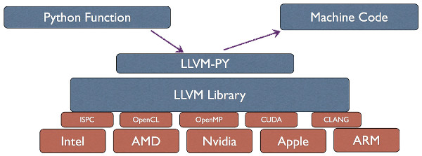

# Why Python?

- Rapid development cycle
- Powerful libraries
- Allows interfacing with native code
    - Excellent for glue
- ... but, slow!
    - especially for computation-heavy code: numerical algorithms

# Why Numba?

## Breaking the speed barrier

- Provides **JIT** for **array-oriented programming** in CPython
- Numerical loops
- Low-level C-like code in pure Python
    - pointers, structs, callbacks

# Why Numba?

## Work with existing tools

- Works with existing CPython extensions
- Goal: Integration with scientific software stack
    - NumPy/SciPy/Blaze
        - indexing and slicing
        - array expressions
        - math
    - C, C++, Fortran, Cython, CFFI, Julia?
    
# Why Numba?

## Minimum effort for Maximum hardware utilization

- High level tools for domains experts to exploit modern hardware
    - multicore CPU
    - manycore GPU
- Easily take advantage of parallelism and accelerators

<!--- Add graphic for array-oriented programming -->


# Software Stack



# @jit, @autojit

- Instead of JIT-ing all Python code, we target the hotspot
- Use decorators to mark functions or classes for *just-in-time* compilation

# Static runtime compilation

```python
@jit(double(double[:, :]))
def func(array):
    ...
```

# Dynamic just-in-time specialization

```python
@autojit
def func(array):
    ...
```

# JIT a Class

```python
@jit
class Shrubbery(object):
    @void(int_, int_)
    def __init__(self, w, h):
        # All instance attributes must be defined in the initializer
        self.width = w
        self.height = h
        # Types can be explicitly specified through casts
        self.some_attr = double(1.0)

    @int_()
    def area(self):
        return self.width * self.height

    @void()
    def describe(self):
        print("This shrubbery is ", self.width,
              "by", self.height, "cubits.")

```

