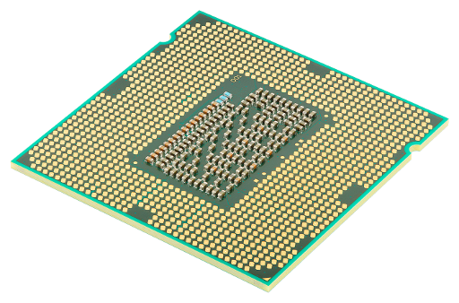
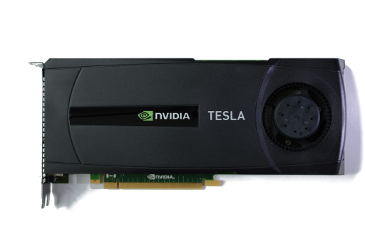
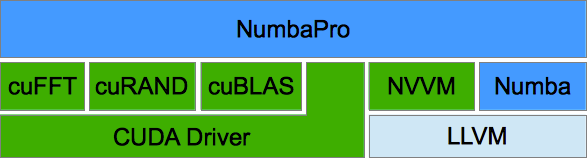
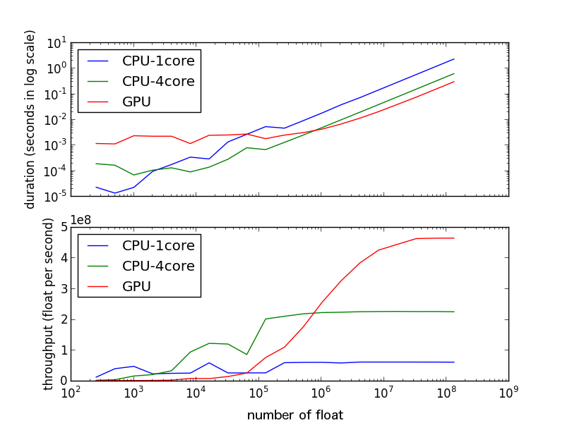
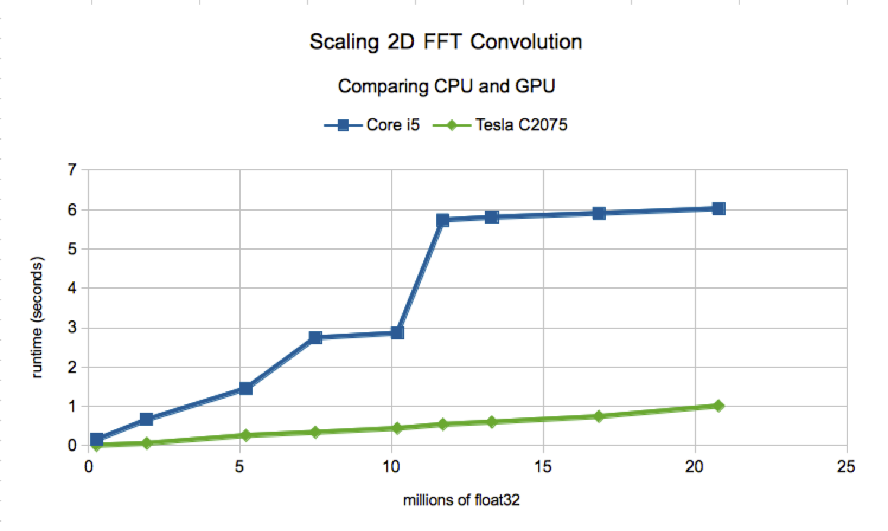
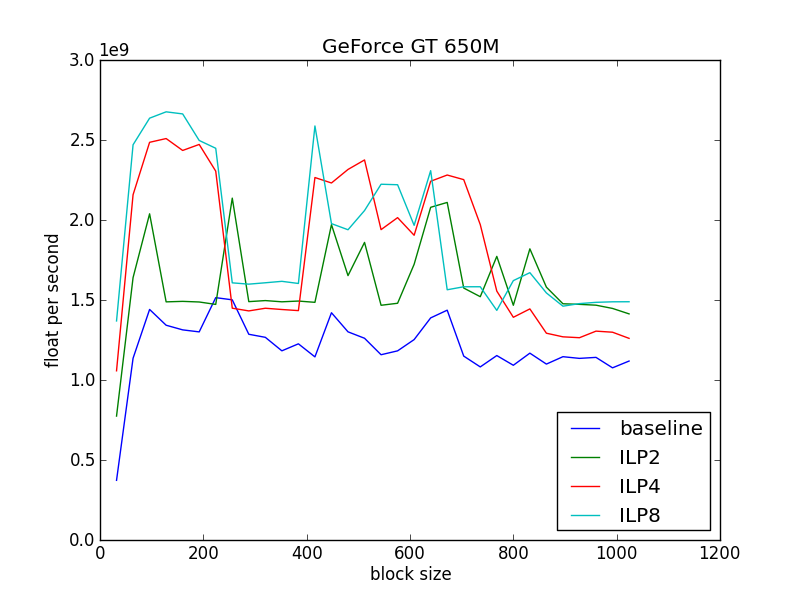

% Pythonic Parallel Patterns for the GPU with NumbaPro
% Siu Kwan Lam
% September 24, 2013

# What is NumbaPro?

## NumbaPro

A commercial extension to Numba

## Numba

- Speedup numeric Python code
- Native code speed
- Free from the GIL

## Numba + Parallel = NumbaPro

### **Accelerate** numerical Python code by fully utilizing **parallel hardware**:

- Multicore CPUs
- Manycore GPUs




# As a JIT Compiler

## Compile Python to:

- CUDA PTX
- Parallel CPU code

## Through simple decorators

### High-level

@vectorize
@guvectorize

### Low-level

@jit
@autojit

# As a Library

## Bindings to

- cuRAND
    - Random number generation
- cuBLAS
    - Linear algebra
- cuFFT
    - Fourier transform

# Softare Stack

## Components



LLVM + NVVM -> PTX

# Why use NumbaPro?

## Use existing data analytics stack

<center>
| NumPy | Scipy | MatPlotlib |
| --- | --- | --- |
| NumExpr | Pandas | PyTables |
| Scikit-Learn | Scikit-Image |
</center>

## Speedup data processing
## Scale to BIG data sets with GPUs effortlessly
## CUDA architecture knowledge not required

# @vectorize

## @vectorize

- Convert a scalar function into a NumPy **Universal function** that operates 
  on NumPy array operands
  
- Applies a **element-wise function** over all dimensions

## Example

```python
from numbapro import vectorize
@vectorize(['float32(float32, float32)'], 
           target='gpu')
def foo(a, b):
    return (a + b) ** 2
```

```python
an_array = numpy.arange(10, dtype=numpy.float32)
a_scalar = numpy.float32(1.2)
foo(an_array, a_scalar)
```

- Call `foo` on any arrays or numeric scalars


## Usage

```python

@vectorize([prototype0,
            prototype1,
            ...],
           target="targetname")
def a_scalar_function(a, b, ...):
    ...

```

## Prototype

- takes 2 float32 and returns a float32

```python
'float32(float32, float32)'
```

- takes 2 int32 and returns a int32

```python
'int32(int32, int32)'
```


## Single CPU code

```python

@vectorize(['float32(float32, float32)'],
           target='cpu')
def foo(a, b):
    return (a + b) ** 2

N = 10000
A = numpy.arange(N, dtype=numpy.float32)
B = numpy.arange(N, dtype=numpy.float32)

C = foo(A, B)

```

## Parallel CPU code

```python

@vectorize(['float32(float32, float32)'],
           target='parallel')
def foo(a, b):
    return (a + b) ** 2

N = 10000
A = numpy.arange(N, dtype=numpy.float32)
B = numpy.arange(N, dtype=numpy.float32)

C = foo(A, B)

```


## CUDA code

```python

@vectorize(['float32(float32, float32)'], 
           target='gpu')
def foo(a, b):
    return (a + b) ** 2

N = 10000
A = numpy.arange(N, dtype=numpy.float32)
B = numpy.arange(N, dtype=numpy.float32)

C = foo(A, B)

```

## Benchmark



## Compile multiple versions for CPU and GPU

```python
def foo(a, b):
    return (a + b) ** 2

prototypes = ['float32(float32, float32)']
cpu_foo = vectorize(prototypes, target='cpu')(foo)
par_foo = vectorize(prototypes, target='parallel')(foo)
gpu_foo = vectorize(prototypes, target='gpu')(foo)
```

## Choose hardware according to the size of your data set


## Scale your program without rewriting your algorithm


# @guvectorize


## Example

Creates a Generalized Universal Function from a Python function

```python
from numbapro import guvectorize
@guvectorize([prototype0,
              prototype1,
              ...], 
             signature)
def gufunc_core(a, b, ...):
    ...
```

Each element is a slice of an array

## Usage

- Prototypes are the same as `@vectorize`
- The signature specifies the dimension requirement:

Signature example matrix-matrix multiplication

```python
"(m, n), (n, p) -> (m, p)"
```

## CPU

```python

prototype = "void(float32[:,:], float32[:,:], float32[:,:])"
@guvectorize([prototype], '(m,n),(n,p)->(m,p)', target='cpu')
def matmulcore(A, B, C):
    m, n = A.shape
    n, p = B.shape
    for i in range(m):
        for j in range(p):
            C[i, j] = 0
            for k in range(n):
                C[i, j] += A[i, k] * B[k, j]
```

## GPU

```python

prototype = "void(float32[:,:], float32[:,:], float32[:,:])"
@guvectorize([prototype], '(m,n),(n,p)->(m,p)', target='gpu')
def matmulcore(A, B, C):
    m, n = A.shape
    n, p = B.shape
    for i in range(m):
        for j in range(p):
            C[i, j] = 0
            for k in range(n):
                C[i, j] += A[i, k] * B[k, j]
```


## In Use

Performs batch matrix-matrix multiplication

```python

matrix_ct = 1000
# creates an array of 1000 x 2 x 4
A = np.arange(matrix_ct * 2 * 4, 
              dtype=np.float32
              ).reshape(matrix_ct, 2, 4)
# creates an array of 1000 x 4 x 5
B = np.arange(matrix_ct * 4 * 5, 
              dtype=np.float32
              ).reshape(matrix_ct, 4, 5)
# outputs an array of 1000 x 2 x 5
C = gufunc(A, B)
```

## Similar to `@vectorize` but use array operands

# Optimize only when necessary

## Manage data movement

between CPU and GPU

## Why??

- Avoid redundant transfer
- Allocate intermediate arrays on the GPU

## to_device

Copy memory to the device

```python
from numbapro import cuda
A = numpy.arange(10)    # cpu
dA = cuda.to_device(A)  # gpu
```

## copy_to_host

Copy memory to back to the host

```python
A = dA.copy_to_host()
```

Note: `dA` is a device array 

## device_array

Allocate device array like NumPy array

```python

B = cuda.device_array(shape=(2,3,4))
C = cuda.device_array(shape=10, 
                      dtype=numpy.float32)
```

# Use CUDA Libraries

## Don't Rewrite

- CUDA Libraries contains highly optimized code

## FFT convolution

- Use cuFFT to build a FFT convolution.

## How?

1. forward FFT transform data and filter
2. multiply data and filter in Fourier domain
3. inverse FFT transform the product

## Forward FFT

### NumbaPro

```python
from numbapro.cudalib import cufft

fft = cufft.fft(host_or_device_array)
cufft.fft_inplace(host_or_device_array)
```

### NumPy

```python
import numpy
fft = numpy.fft.fft(array)
```

## Inverse FFT

### NumbaPro

```python
from numbapro.cudalib import cufft

ifft = cufft.ifft(host_or_device_array)
cufft.ifft_inplace(host_or_device_array)
```

### NumPy

```python
import numpy
ifft = numpy.fft.ifft(ary)
```

## Code: FFT Convolution

```python
@vectorize(['complex64(complex64, complex64)'],
           target='gpu')
def vmult(a, b):
    return a * b
```

```python
# host -> device
d_img = cuda.to_device(img)     # image
d_fltr = cuda.to_device(fltr)   # filter
# FFT forward
cufft.fft_inplace(d_img)
cufft.fft_inplace(d_fltr)
# multply
vmult(d_img, d_fltr, out=d_img) # inplace
# FFT inverse
cufft.ifft_inplace(d_img)
# device -> host
filted_img = d_img.copy_to_host()
```
Works for 1D, 2D, 3D images

## Benchmark



# A Deeper Dive

# Details of @vectorize

## A @vectorize Example

```python
@vectorize(['float32(float32, float32)'],
           target='gpu')
def foo(a, b):
    return (a + b) ** 2
```

## CUDA-C Equivalent

It is roughly equivalent to:

```C
__global__
void foo1D(float A[], float B[], float Out[], int Nelem){
    int tid = threadIdx.x;
    int ctaid = blockIdx.x;
    int ntid = blockDim.x;
    int i = tid + ctaid * ntid;
    if ( i >= Nelem )   
        return;
    float temp = A[i] + B[i];
    Out[i] = temp * temp;
}
```

## Launch Code

Python

```python
dOut = foo(dA, dB)
```

CUDA-C
```C
foo1D<<<gridDim, blockDim>>>(dA, dB, dOut, Nelem);
```

The launch code for the Python version is a lot simpler.

## Inside the Launch

- Divide work among blocks and threads
- Compute optimal threads-per-block
    - if compile log is available from the driver.
    - optimize for optimal warp occupancy.

## Future: ILP Autotune

- Autotune for instruction-level parallelism (ILP)
- **ILP is necessary** for peak performance in Kepler generation card.

## ILP

- Maybe impractical for manual unroll
- But it can be done by the compiler



## High-Level APIs

- High-level APIs like @vectorize and @guvectorize **decouples low-level details from the user**
- Users concern only about the algorithm
- Let the compiler do the optimization for portability
- We will be doing more of this


# Writing Low-level code in Python

## Why Low-level Python?

- Manual optimization
- Pattern not yet recognized by the compiler
- Library writers

## @cuda.jit

Python
```python
from numbapro import cuda
@cuda.jit('void(float32[:], float32[:], float32[:])')
def foo(A, B, Out):
    tid = cuda.threadIdx.x
    ctaid = cuda.blockIdx.x
    ntid = cuda.blockDim.x
    i = tid + ctaid * ntid
    if i >= Out.shape[0]:
        return
    Out[i] =  A[i] + B[i]
```

CUDA-C
```C
__global__
void foo(float A[], float B[], float Out[], int N) {
    int tid = threadIdx.x;
    int ctaid = blockIdx.x;
    int ntid = blockDim.x;
    int i = tid + ctaid * ntid;
    if ( i >= N )   
        return;
    Out[i] = A[i] + B[i]
}
```

## Access to Shared Memory

```python
from numbapro import cuda, float32
@cuda.jit('void(float32[:,:], float32[:,:], float32[:,:])')
def matrix_matrix_mult(A, B, C):
    # allocate shared memory like NumPy array
    # __shared__ float32 sA[tpb][tpb];
    sA = cuda.shared.array(shape=(tpb, tpb), dtype=float32)
    sB = cuda.shared.array(shape=(tpb, tpb), dtype=float32)
    
    ...

    for i in range(bpg):
        if x < n and y < n:
            sA[ty, tx] = A[y, tx + i * tpb]
            sB[ty, tx] = B[ty + i * tpb, x]

        cuda.syncthreads()        # barrier __syncthreads()

    ...
```

# As a Glue

## Why not glue CUDA-C/C++ device function?

- Python is already a good glue language
- Workaround for missing feature in NumbaPro

## Gluing CUDA-C/C++ code (Experimental Feature)

Using CUDA JIT Linking.

## A device function in CUDA-C

bar.cu

```C
extern "C"{
__device__
void bar(int a, int* out) {
    *out = a * 2;
}
}
```

## Compile .cu files

```bash
nvcc -arch=sm_20 -dc bar.cu  -o bar.o
```

## Use it in NumbaPro

```python
bar = cuda.declare_device('bar', 'int32(int32)')

@cuda.jit('void(int32[:], int32[:])', link=['bar.o'])
def foo(x, y):
    i = cuda.grid(1)    # threadIdx.x + blockIdx.x * blockDim.x
    x[i] += bar(y[i])   # call to extern C function
```


# Finally...

## Summary

We have seen...

- Decorators for compiling Python for CUDA
- CUDA memory transfers API
- cuFFT-based convolution
- Low-level CUDA code in Python
- Gluing CUDA-C/C++ code with JIT Linking

## CUDA + Python Course

- Continuum will be offering an **introductory CUDA course in Python** in the near future.
- For Python programmers with **no CUDA experience**


## Questions?

<hr />

### Where to Get?

In Anaconda Accelerate
[https://store.continuum.io/cshop/accelerate/](https://store.continuum.io/cshop/accelerate/)


More Examples: [https://github.com/ContinuumIO/numbapro-examples](https://github.com/ContinuumIO/numbapro-examples)

